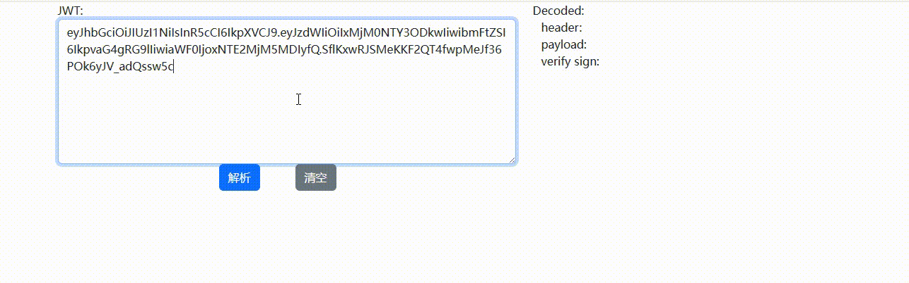
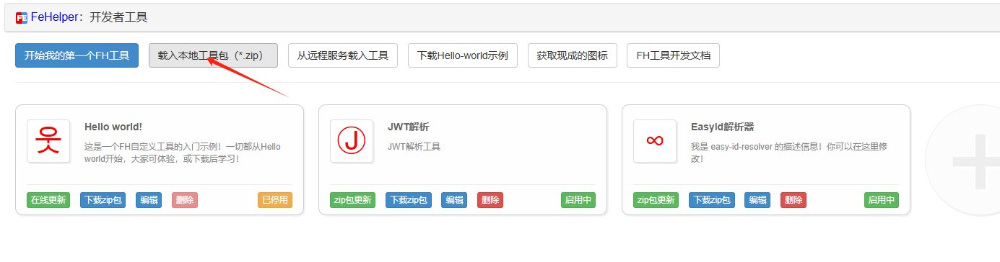

# FeHelper JWT 解析插件

用于向FeHelper中添加JWT解析功能的插件。

## 使用效果

## 使用方法

### 1、安装FeHelper
该步骤省略，详情请到[插件官网](https://www.baidufe.com/fehelper/index/index.html)了解
### 2、安装FH开发者工具
安装完FeHelper后，进入插件设置，安装FeHelper开发者工具。
### 3、克隆本项目并打包
克隆本项目到本地，进入src目录，对目录中的内容进行打包压缩为.zip包
### 4、安装插件
进入FH开发者工具后选择`载入本地工具包`

选择刚刚打出来的zip包。完成安装，**确认插件状态为启用中**。

### 5、使用插件
点击浏览器FeHelper插件，选择JWT解析工具，即可进入插件进行JWT解析

## FAQ

>>1、为什么要做这么一个东西

因为用JWT的地方实在太多了，有的时候难免需要对JWT内容进行解析帮助一些debug，这本身是件非常容易的事情，但是我希望方便、快捷地完成这个工作。用过无数次 jwt.io 很好，但是因为访问速度过慢，常常让我这个急性子很焦虑。而FeHelper本是个很好的载体，也在项目issue中看到了有同学在呼唤这个功能，奈何一直没上这个功能，于是自己手搓了一个，提升自己的debug体验。

>>2、为什么不做JSON格式化

目前常见的前端JSON格式化工具，都会把JSON进行反序列化以后再进行序列化以完成格式化展示，这里面有个`大坑`：**Bigint**的支持不到位导致的丢精度问题，我在使用 jwt.io 时就被这个问题坑过，JWT中包含一个long型整数，解析出来数字就不对了。今后，如果有空，也许会做格式化，现在的话FeHelper本身有JSON格式化功能，也可以将就一下对吧。